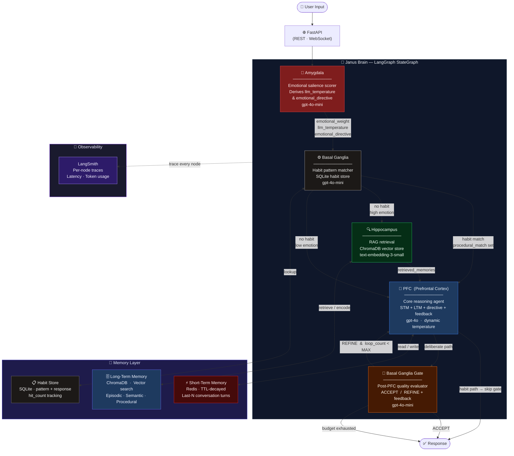

<div align="center">

# 🧠 Janus Process

### *A brain-inspired multi-agent cognitive architecture for next-generation AI reasoning*

[](https://python.org)
[](https://langchain-ai.github.io/langgraph/)
[](https://langchain.com)
[](https://fastapi.tiangolo.com)
[](https://redis.io)
[](https://trychroma.com)
[](https://openai.com)
[](tests/)
[](https://smith.langchain.com)

</div>

---

## Why Janus?

Most AI systems are **stateless pipelines** — they receive a prompt and emit a response with no sense of emotional context, no persistent memory, and no ability to evaluate or revise their own output before it reaches the user.

**Janus Process is different.**

Modelled directly on the functional regions of the human brain, Janus routes every request through a multi-agent graph that mirrors real cognition: emotional threat detection, memory consolidation, habit recall, deliberative reasoning, and self-correcting quality gating — all before a single word reaches the user.

The result is an AI reasoning engine that is:

| Property | Janus | Typical RAG/LLM Pipeline |
|---|---|---|
| Emotionally-aware | ✅ Dynamic temperature + directive injection | ❌ Static prompts |
| Self-correcting | ✅ Iterative PFC ↔ BG refinement loop | ❌ Single-shot generation |
| Persistent memory | ✅ Two-tier STM (Redis) + LTM (ChromaDB) | ❌ Stateless per request |
| Habit/procedural fast-path | ✅ SQLite habit store, bypasses LLM | ❌ Every query hits the LLM |
| Production observable | ✅ LangSmith tracing per agent node | ❌ Black-box inference |

---

## Cognitive Architecture



---

## The Five Cognitive Agents

### 💢 Amygdala — Emotional Threat Detector
The first node every input passes through. Rates emotional salience (0.0–1.0) and dynamically adjusts downstream behaviour:

| Emotional Weight | LLM Temperature | PFC Directive |
|---|---|---|
| < 0.2 (neutral) | 0.7 (creative) | — |
| 0.2–0.5 (mild) | 0.5 | *Be warm and supportive* |
| 0.5–0.7 (stressed) | 0.3 | *Acknowledge feelings before responding* |
| > 0.7 (crisis) | 0.1 (precise) | *Prioritise emotional safety and calm compassion* |

### ⚙️ Basal Ganglia — Habit Fast-Path + Response Gate
Two roles in one region. **Pre-PFC:** matches input against learned habits in SQLite — known patterns bypass expensive LLM reasoning entirely. **Post-PFC:** a quality gate that evaluates every deliberate response before release, issuing `ACCEPT` or `REFINE: <instruction>`.

### 🔍 Hippocampus — Long-Term Memory Retrieval
On high-emotion inputs, retrieves semantically relevant past experiences from ChromaDB using MMR (Maximum Marginal Relevance) for diverse, non-redundant context. Simultaneously encodes the current exchange into persistent memory with emotional weight as metadata.

### 🧩 PFC — Prefrontal Cortex (Core Reasoning)
The primary synthesis agent. Combines short-term conversation history (Redis), long-term retrieved memories, the current emotional directive, and any refinement feedback from the gate into a coherent, context-aware response. Runs `gpt-4o` at a temperature set by the Amygdala's assessment.

### 🚦 PFC ↔ Basal Ganglia Recurrent Loop
Biologically, deliberate cognition is iterative — the PFC and BG cycle through competing plans. The LangGraph topology makes this explicit:

```
PFC proposal → Gate evaluation
    ACCEPT  ──────────────────────────────────────► response
    REFINE  ──► (loop_count < MAX_PFC_LOOPS) ──► PFC
    REFINE  ──► (budget exhausted) ──────────────► best-effort response
```

---

## Technology Stack

| Layer | Technology | Role |
|---|---|---|
| **Orchestration** | [LangGraph 1.2](https://langchain-ai.github.io/langgraph/) | Stateful multi-agent `StateGraph` with conditional routing and loop edges |
| **LLM (reasoning)** | OpenAI `gpt-4o` | PFC synthesis — dynamic temperature per turn |
| **LLM (fast)** | OpenAI `gpt-4o-mini` | Amygdala scoring · BG habit matching · BG gate evaluation |
| **Embeddings** | OpenAI `text-embedding-3-small` | ChromaDB ingestion and retrieval |
| **Short-Term Memory** | Redis + `RedisChatMessageHistory` | TTL-decayed sliding window conversation buffer |
| **Long-Term Memory** | ChromaDB (vector store) | Episodic, semantic, and procedural memory with MMR retrieval |
| **Habit Store** | SQLite / Postgres | Structured habit patterns with hit-count tracking |
| **API** | FastAPI | `POST /think` · `WS /think/stream` · `GET /memory/search` |
| **Tracing** | LangSmith | Per-node latency, token usage, full run history |
| **Containerisation** | Docker Compose | Redis + ChromaDB services, multi-stage production image |
| **Testing** | pytest + pytest-asyncio | 150+ unit and integration tests across 16 phases |
| **Lint / Types** | ruff + mypy | CI-enforced code quality |

---

## Quick Start

```bash
# 1. Clone and create virtual environment
git clone https://github.com/your-org/janus-process.git
cd janus-process
python3 -m venv .venv && source .venv/bin/activate

# 2. Install dependencies
pip install -U pip setuptools wheel
pip install -e '.[dev]'

# 3. Configure environment
cp .env.example .env
# Add: OPENAI_API_KEY, LANGSMITH_API_KEY

# 4. Start infrastructure
docker compose up -d          # Redis + ChromaDB

# 5. Run the interactive CLI
python main.py
```

```
Janus Process  (Ctrl-C to exit)

You: I'm really anxious about my presentation tomorrow
Brain: I can hear that you're feeling a lot of pressure right now...
```

---

## API

```bash
# Single-turn reasoning
curl -X POST http://localhost:8000/think \
  -H "Content-Type: application/json" \
  -d '{"input": "What is the capital of France?"}'

# Semantic memory search
curl "http://localhost:8000/memory/search?q=Paris"

# WebSocket streaming
wscat -c ws://localhost:8000/think/stream
```

---

## Test Suite

```bash
python -m pytest -q                          # all tests
python -m pytest -m "not integration" -q    # unit tests only (no Docker required)
python -m pytest tests/test_phase16_recurrent_loop.py -v
```

The test suite spans 16 implementation phases and covers every agent node, routing decision, memory layer, and recurrent loop behaviour with mocked LLM calls for deterministic unit testing.

---

## Roadmap

| Phase | Description | Status |
|---|---|---|
| 1–13 | Foundation · STM · LTM · Amygdala · Hippocampus · PFC · Basal Ganglia · Thalamus · Consolidator · API · Observability · Hardening · LTM Summarisation | ✅ Complete |
| 14 | Amygdala as Global State Modifier (dynamic temperature + directive injection) | ✅ Complete |
| 15 | Basal Ganglia Response Gate (post-PFC inhibitory gating) | ✅ Complete |
| 16 | PFC ↔ Basal Ganglia Recurrent Loop (iterative self-refinement) | ✅ Complete |
| 17+ | Multi-modal inputs · Long-horizon planning · Agent-to-agent delegation | 🔜 Planned |

---

## Local Development Notes

- The `.venv/` directory is excluded from git via `.gitignore`.
- Integration tests require Docker (`docker compose up -d`).
- LangSmith tracing is enabled automatically when `LANGCHAIN_TRACING_V2=true` and `LANGCHAIN_API_KEY` are set in `.env`.
- `MAX_PFC_LOOPS` (default `2`) is configurable via environment variable to control the PFC ↔ BG loop budget.
